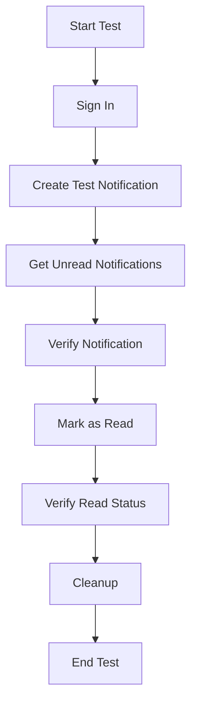

# Notifications System

This document provides an overview of the Notifications system, including its architecture, API, and test suite.

## Table of Contents
- [Overview](#overview)
- [API Reference](#api-reference)
- [Test Suite](#test-suite)
- [Flow Diagram](#flow-diagram)
- [Usage Examples](#usage-examples)
- [Error Handling](#error-handling)
- [Testing](#testing)

## Overview

The Notifications system provides real-time and historical notification capabilities for users. It's built on top of Supabase and supports various notification types including application status updates, job updates, and interview reminders.

## API Reference

### `getUnreadNotifications()`
Retrieves all unread notifications for the currently authenticated user.

**Returns:**
- `Promise<Notification[]>` - Array of unread notification objects

**Example:**
```typescript
const notifications = await getUnreadNotifications();
```

### `markNotificationRead(notifId: string)`
Marks a specific notification as read.

**Parameters:**
- `notifId` (string) - The ID of the notification to mark as read

**Example:**
```typescript
await markNotificationRead('notification-123');
```

## Test Suite

The test suite verifies the core functionality of the notifications system:

### Test Flow
1. **Authentication**
   - Signs in with test user credentials
   - Handles user session management

2. **Notification Creation**
   - Creates a test notification with sample data
   - Verifies successful creation with all required fields

3. **Notification Retrieval**
   - Fetches unread notifications
   - Verifies the test notification is present
   - Validates all required fields are returned

4. **Mark as Read**
   - Marks the test notification as read
   - Verifies the read status is updated

5. **Cleanup**
   - Signs out the test user
   - (Optional) Cleans up test data

## Flow Diagram



## Usage Examples

### Creating a Notification
```typescript
const { data, error } = await supabase
  .from('notifications')
  .insert([{
    user_id: 'user-123',
    type: 'application_status',
    title: 'Application Update',
    message: 'Your application has been reviewed',
    read: false,
    metadata: { applicationId: 'app-123' }
  }])
  .select();
```

### Subscribing to Real-time Updates
```typescript
const subscription = supabase
  .channel('notifications')
  .on('postgres_changes', 
    { 
      event: 'INSERT',
      schema: 'public',
      table: 'notifications',
      filter: 'user_id=eq.' + userId
    },
    (payload) => {
      console.log('New notification:', payload.new);
    }
  )
  .subscribe();
```

## Error Handling

All API functions throw errors that can be caught and handled by the calling code:

```typescript
try {
  await markNotificationRead('invalid-id');
} catch (error) {
  console.error('Failed to mark notification as read:', error.message);
}
```

## Testing

To run the test suite:

```bash
npx ts-node notifications.test.ts
```

### Test Coverage
- Authentication flow
- Notification CRUD operations
- Data validation
- Error conditions
- Cleanup procedures

## Environment Variables

Ensure these environment variables are set:
- `NEXT_PUBLIC_SUPABASE_URL`
- `NEXT_PUBLIC_SUPABASE_ANON_KEY`

## Dependencies
- @supabase/supabase-js
- TypeScript
- Node.js
